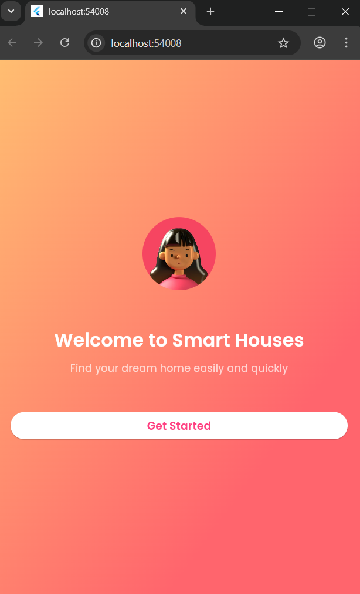
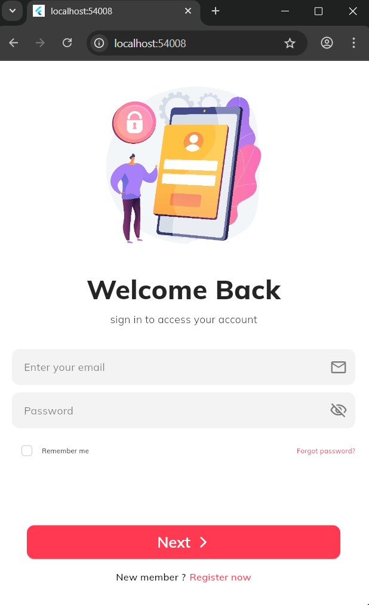
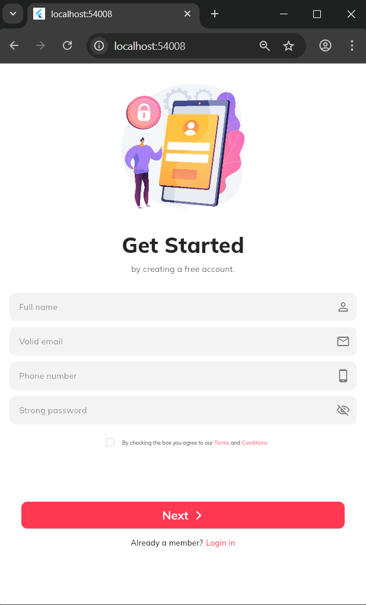
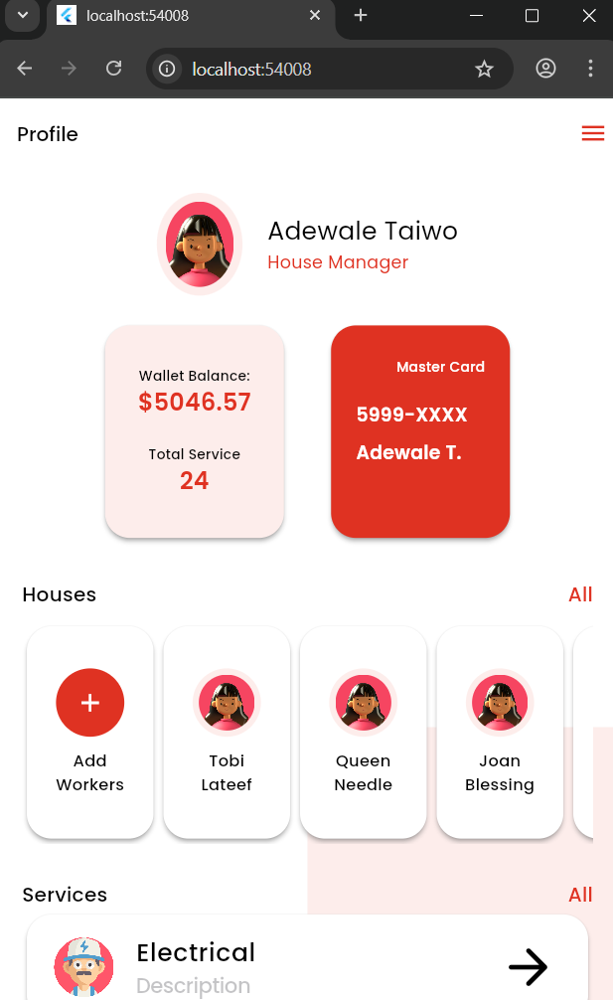
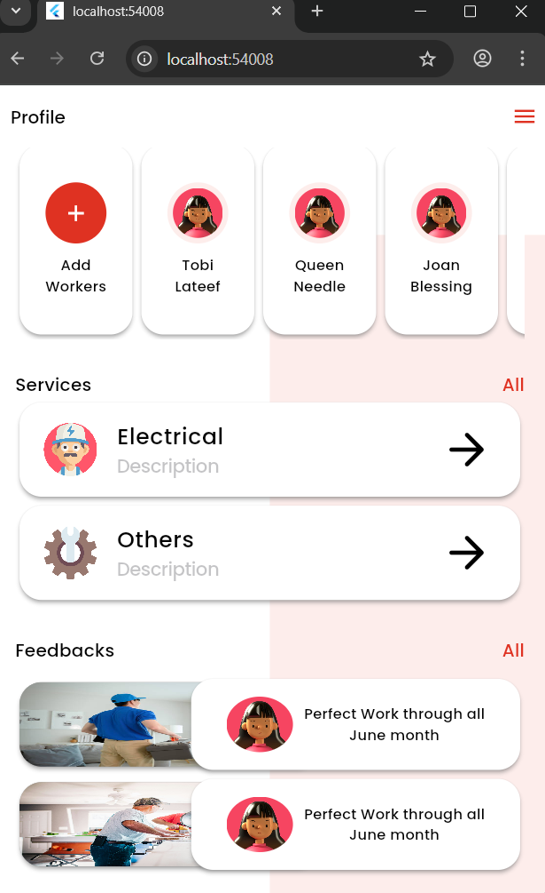

# Flutter UI Task 3 🚀

## Project Introduction 🎯

**Project Name**: Flutter UI Task 3

**Description**:  
This project is a collection of user interfaces (UI) designed using Flutter, including multiple screens such as Splash Screen, Login, Register, Home, Services, and Houses. The goal of the project is to implement professional UI design using various available Flutter widgets to achieve a smooth and efficient user experience.

## Project Structure 📂

- **assets**: Contains fonts and images.
- **build**: Contains the compiled files.
- **lib**: Contains the source code of the project.
  - **constants**: Includes files like `colors.dart`, `dimens.dart`, `paths.dart`, `strings.dart`.
  - **custom_widget_design**: Contains custom widgets like `circular_widget.dart`, `custom_button.dart`, `custom_card.dart`.
  - **pages**: Contains the application pages like `home_page.dart`, `login_page.dart`, `register_page.dart`, `splash_screen.dart`.
  - **main.dart**: The main entry point of the app.

## Technologies Used 💻

- **Programming Language**: Dart
- **Framework**: Flutter
- **Styles**: Customizable user interface designs using various Flutter widgets.

## Widgets Used 🔧:

- **Container**: To organize content within the UI.
- **ListView.builder**: To display items in a flexible, scrollable list.
- **SizedBox**: For defining spacing between elements.
- **Text**: For displaying text content.
- **Image.asset**: To display local images.
- **Card**: To present content in a card-like structure.
- **ElevatedButton**: For creating raised buttons.
- **Checkbox**: For creating checkboxes.
- **Inkwell**: To make elements clickable.
- **Row, Column**: To arrange elements horizontally and vertically.
- **Form, TextFormField**: For creating input forms.
- **Align, Positioned, Stack**: For complex positioning of elements.
- **SingleChildScrollView**: To enable vertical scrolling.
- **ListTile**: To display list items in a well-organized manner.
- **AppBar, Icon, IconButton**: For creating a top app bar with icons.
- **Scaffold**: Provides basic structure for pages.
- **MaterialApp**: To define overall app properties.
- **Themedata**: For global theme settings.
- **Padding**: To add padding inside elements.
- **ClipOval**: For cropping elements into oval shapes.
- **Center**: To center elements inside their parent container.
- **RichText, TextSpan**: To display rich text with different formatting.
- **Snackbar**: For displaying temporary messages.

## Key Features of the Project 🛠️

- **Splash Screen**: Appears when the app is first launched, typically containing a logo or introductory information.
- **Login & Register Pages**: Pages for user login and registration with input forms.
- **Home Page**: The main page containing links to services and houses.
- **Services & Houses Pages**: Pages that display services and house listings with interactive elements.

## Project Images 📸

### 1. Splash Screen 

| Splash Screen |
| --- | --- |
|  

### 2. Login Page & Register PAge 

| Login Page | Register Page |
| --- | --- |
|  |  |

### 3. Home Page

| Home Page |
| --- | --- |
|  |  |

## Project Structure 📁

The project follows a clean and organized directory structure:

```plaintext
assets
 ├── fonts
 └── images

build
 └── <Build Files>

lib
 ├── constants
 │   ├── colors.dart
 │   ├── dimens.dart
 │   ├── paths.dart
 │   └── strings.dart
 ├── custom_widget_design
 │   ├── circular_widget.dart
 │   ├── custom_button.dart
 │   ├── custom_card.dart
 │   ├── custom_checkbox.dart
 │   ├── custom_section_name.dart
 │   └── custom_text_field.dart
 ├── pages
 │   ├── home_page.dart
 │   ├── login_page.dart
 │   ├── register_page.dart
 │   ├── splash_screen.dart
 └── main.dart
